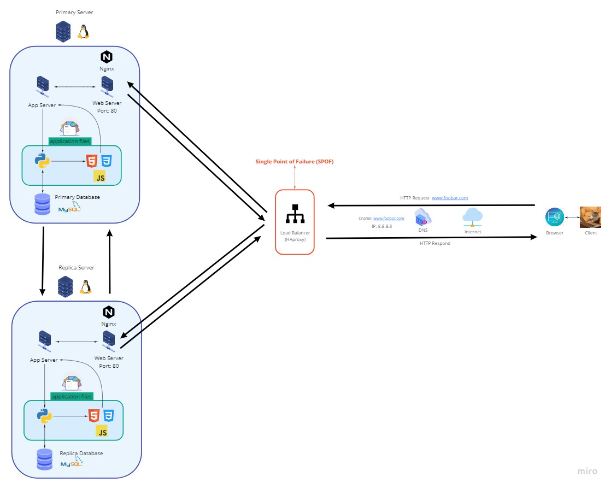

# 0. Simple web stack

## Why are we adding a second server?

Adding a second server creates a distributed web infrastructure that tries to reduce traffic to the main server by distributing part of the load to a replica server with the help of a Load Balancer responsible for balancing the load between the two servers (primary and replica).

## What distribution algorithm your load balancer is configured with and how it works

The HAProxy load balancer is configured with the Round Robin distribution algorithm. This algorithm works by using each server behind the load balancer in turn. As a dynamic algorithm, Round Robin allows you to adjust server loads on the fly.

## The configuration enabled by the load balancer.

The HAProxy load balancer is enabling an Active-Passive configuration instead of an Active-Active configuration. In an Active-Active configuration, the load balancer spreads workloads across all nodes to prevent a single node from becoming overloaded. Because there are more nodes available to serve, there will also be a noticeable improvement in performance and response times. On the other hand, in an Active-Passive configuration, not all nodes will be active (capable of receiving workloads at all times). In the case of two nodes, for example, if the first node is already active, the second node must be passive or standby. The second or next passive node can become an active node if the previous node is down.

## How a database Primary-Replica (Master-Slave) cluster works

One server acts as the main server and the other as a replica of the main server. However, the primary server can make read/write requests, while the replica server can only make read requests. Data is synchronized between the servers (primary and replica) each time the primary server executes a write operation.

## What is the difference between the Primary node and the Replica node in regard to the application

The primary node is responsible for all write operations required by the site, while the replica node is capable of processing read operations, reducing read traffic to the primary node.

## Problems with this infrastructure

There are multiple SPOF (Single Point Of Failure).
In this case it is the load balancer since it communicates directly with the client.
Another SPOF may be the main MySQL database is down, the entire site will not be able to make changes (add or remove users).

## Security issues (not firewall, not HTTPS)

Data transmitted over the network is not encrypted using an SSL certificate so hackers can 
steal data on the network between your browser and our server. There is no way to block unauthorized IP addresses as there is no firewall installed on any server.

## Not monitored

We have no way of knowing the status of each server as they are not being monitored.
